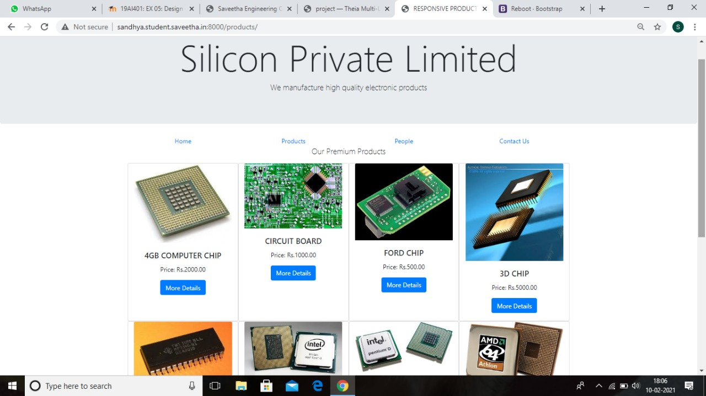
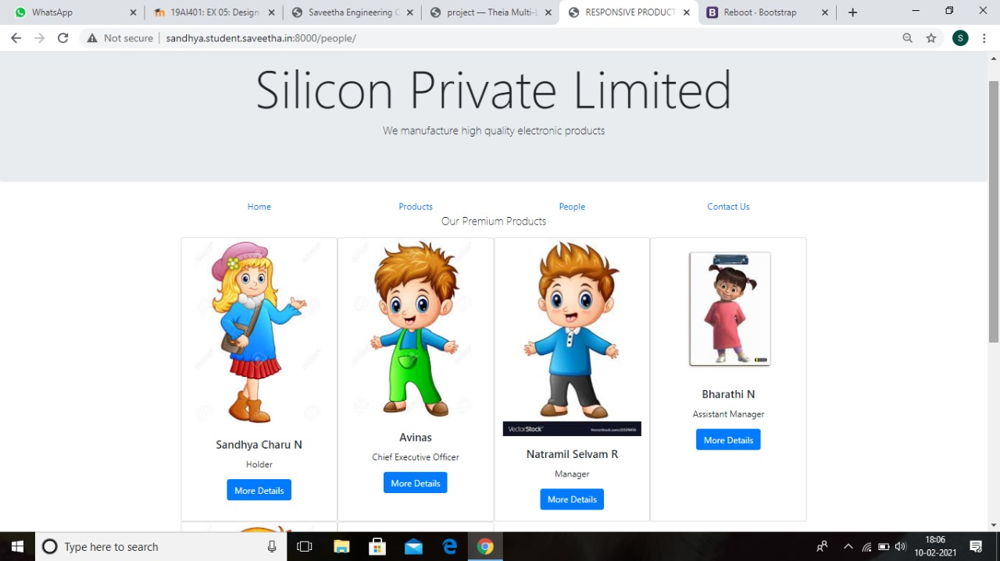
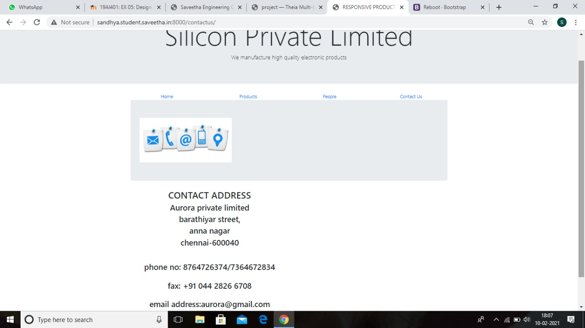
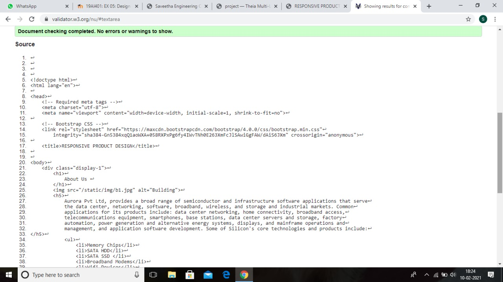
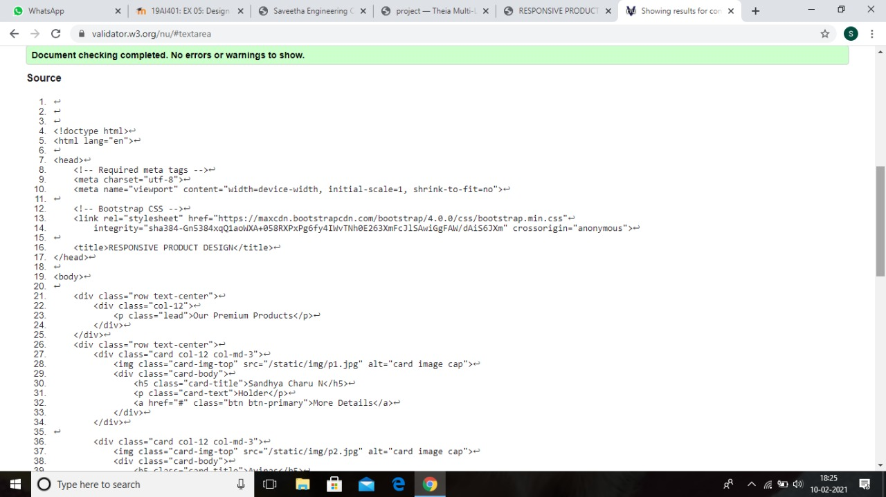

# Design of Responsive Website
## AIM:
To design a responsive website with two break points.

## DESIGN STEPS:
### Step 1: 
Requirement collection.
### Step 2:
Creating the layout using HTML and CSS.
### Step 3:
Updating the sample content.
### Step 4:
Choose the appropriate style and color scheme.
### Step 5:
Validate the layout in various browsers.
### Step 6:
Validate the HTML code.
### Step 7:
Create a database model and migrate the database.
### Step 8:
Retrieve data from database and display it in a dynamic webpage.
### Step 9:
Publish the website in the given URL.

## PROGRAM:
### base.html
```

<!DOCTYPE html>
<html lang="en">

<head>
   <div class="jumbotron">
        <div class="container text-center">
            <h1 class="display-1">Silicon Private Limited</h1>
            <p class="lead">We manufacture high quality electronic products</p>
        </div>
    </div>
</head>
<body>
    
    <div class="container">
         <div class="row text-center">
            <div class="col-12 col-md-3"><a href="/Home.html">Home</a></div>
            <div class="col-12 col-md-3"><a href="/products.html">Products</a></div>
            <div class="col-12 col-md-3"><a href="/People.html">People</a></div>
            <div class="col-12 col-md-3"><a href="/contactus.html">Contact Us</a></div>
        </div>
     
    
    
    
    </div>
    <div class="col-12 text-center">
       <br> <br> <br> <br> Copyright © 2021 Silicon Private Limited, Developed by Sandhya Charu.
    </div>
    </div>
</body>

</html>

```

### home.html
```




<!doctype html>
<html lang="en">

<head>
    <!-- Required meta tags -->
    <meta charset="utf-8">
    <meta name="viewport" content="width=device-width, initial-scale=1, shrink-to-fit=no">

    <!-- Bootstrap CSS -->
    <link rel="stylesheet" href="https://maxcdn.bootstrapcdn.com/bootstrap/4.0.0/css/bootstrap.min.css"
        integrity="sha384-Gn5384xqQ1aoWXA+058RXPxPg6fy4IWvTNh0E263XmFcJlSAwiGgFAW/dAiS6JXm" crossorigin="anonymous">

    <title>RESPONSIVE PRODUCT DESIGN</title>

<body>
    <div class="display-1">
        <h1>
            <div class="about">About Us </div>
        </h1>
        
        <h5>
            Aurora Pvt Ltd, provides a broad range of semiconductor and infrastructure software applications that serve
            the data center, networking, software, broadband, wireless, and storage and industrial markets. Common
            applications for its products include: data center networking, home connectivity, broadband access,
            telecommunications equipment, smartphones, base stations, data center servers and storage, factory
            automation, power generation and alternative energy systems, displays, and mainframe operations and
            management, and application software development. Some of Silicon's core technologies and products include:
            <ul>
                <li>Memory Chips</li>
                <li>SATA HDD</li>
                <li>SATA SSD </li>
                <li>Broadband Modems</li>
                <li>Wifi Devices</li>
                <li>Switching Devices</li>
                <li>Optical Sensors</li>
            </ul>
        </h5>
        </div>
    

    <!-- Optional JavaScript -->
    <!-- jQuery first, then Popper.js, then Bootstrap JS -->
    <script src="https://code.jquery.com/jquery-3.2.1.slim.min.js"
        integrity="sha384-KJ3o2DKtIkvYIK3UENzmM7KCkRr/rE9/Qpg6aAZGJwFDMVNA/GpGFF93hXpG5KkN"
        crossorigin="anonymous"></script>
    <script src="https://cdnjs.cloudflare.com/ajax/libs/popper.js/1.12.9/umd/popper.min.js"
        integrity="sha384-ApNbgh9B+Y1QKtv3Rn7W3mgPxhU9K/ScQsAP7hUibX39j7fakFPskvXusvfa0b4Q"
        crossorigin="anonymous"></script>
    <script src="https://maxcdn.bootstrapcdn.com/bootstrap/4.0.0/js/bootstrap.min.js"
        integrity="sha384-JZR6Spejh4U02d8jOt6vLEHfe/JQGiRRSQQxSfFWpi1MquVdAyjUar5+76PVCmYl"
        crossorigin="anonymous"></script>
</body>

</html>


```
### products.html
```




<!doctype html>
<html lang="en">

<head>
    <!-- Required meta tags -->
    <meta charset="utf-8">
    <meta name="viewport" content="width=device-width, initial-scale=1, shrink-to-fit=no">

    <!-- Bootstrap CSS -->
    <link rel="stylesheet" href="https://maxcdn.bootstrapcdn.com/bootstrap/4.0.0/css/bootstrap.min.css"
        integrity="sha384-Gn5384xqQ1aoWXA+058RXPxPg6fy4IWvTNh0E263XmFcJlSAwiGgFAW/dAiS6JXm" crossorigin="anonymous">

    <title>RESPONSIVE PRODUCT DESIGN</title>
</head>

<body>

    <div class="row text-center">
        <div class="col-12">
            <p class="lead">Our Premium Products</p>
        </div>
    </div>
    <div class="row text-center">
        <div class="card col-12 col-md-3">
            
            <div class="card-body">
                <h5 class="card-title">4GB COMPUTER CHIP</h5>
                <p class="card-text">Price: Rs.2000.00</p>
                <a href="#" class="btn btn-primary">More Details</a>
            </div>
        </div>

        <div class="card col-12 col-md-3">
            
            <div class="card-body">
                <h5 class="card-title">CIRCUIT BOARD</h5>
                <p class="card-text">Price: Rs.1000.00</p>
                <a href="#" class="btn btn-primary">More Details</a>
            </div>
        </div>

        <div class="card col-12 col-md-3">
            
            <div class="card-body">
                <h5 class="card-title">FORD CHIP</h5>
                <p class="card-text">Price: Rs.500.00</p>
                <a href="#" class="btn btn-primary">More Details</a>
            </div>
        </div>

        <div class="card col-12 col-md-3">
            
            <div class="card-body">
                <h5 class="card-title">3D CHIP</h5>
                <p class="card-text">Price: Rs.5000.00</p>
                <a href="#" class="btn btn-primary">More Details</a>

            </div>
        </div>

        <div class="card col-12 col-md-3">
            
            <div class="card-body">
                <h5 class="card-title">MICROPROCESSER</h5>
                <p class="card-text">price: Rs.3000.00</p>
                <a href="#" class="btn btn-primary">More Details</a>
            </div>

        </div>

        <div class="card col-12 col-md-3">
            
            <div class="card-body">
                <h5 class="card-title">INTEL CORE CPU</h5>
                <p class="card-text">Price: Rs.3000.00</p>
                <a href="#" class="btn btn-primary">More Details</a>
            </div>

        </div>

        <div class="card col-12 col-md-3">
            
            <div class="card-body">
                <h5 class="card-title">INTEL PENTIUM-D</h5>
                <p class="card-text">Price: Rs.500.00</p>
                <a href="#" class="btn btn-primary">More Details</a>
            </div>

        </div>

        <div class="card col-12 col-md-3">
            
            <div class="card-body">
                <h5 class="card-title">AMD 64 ATHLON</h5>
                <p class="card-text">Price: Rs.1000.00</p>
                <a href="#" class="btn btn-primary">More Details</a>
            </div>

        </div>

        <div class="card col-12 col-md-3">
            
            <div class="card-body">
                <h5 class="card-title">HARDWARE</h5>
                <p class="card-text">Price: Rs.1500.00</p>
                <a href="#" class="btn btn-primary">More Details</a>
            </div>

        </div>

        <div class="card col-12 col-md-3">
            
            <div class="card-body">
                <h5 class="card-title">MC68000CN8 CPU</h5>
                <p class="card-text">Price: Rs.2500.00</p>
                <a href="#" class="btn btn-primary">More Details</a>
            </div>

        </div>

        <div class="card col-12 col-md-3">
            
            <div class="card-body">
                <h5 class="card-title">ARM CHIP</h5>
                <p class="card-text">Price: Rs.2500.00</p>
                <a href="#" class="btn btn-primary">More Details</a>
            </div>

        </div>
        <div class="card col-12 col-md-3">
            
            <div class="card-body">
                <h5 class="card-title">3D RAM</h5>
                <p class="card-text">Price: Rs.9000.00</p>
                <a href="#" class="btn btn-primary">More Details</a>
            </div>

        </div>

    </div>
    </div>
    <!-- Optional JavaScript -->
    <!-- jQuery first, then Popper.js, then Bootstrap JS -->
    <script src="https://code.jquery.com/jquery-3.2.1.slim.min.js"
        integrity="sha384-KJ3o2DKtIkvYIK3UENzmM7KCkRr/rE9/Qpg6aAZGJwFDMVNA/GpGFF93hXpG5KkN"
        crossorigin="anonymous"></script>
    <script src="https://cdnjs.cloudflare.com/ajax/libs/popper.js/1.12.9/umd/popper.min.js"
        integrity="sha384-ApNbgh9B+Y1QKtv3Rn7W3mgPxhU9K/ScQsAP7hUibX39j7fakFPskvXusvfa0b4Q"
        crossorigin="anonymous"></script>
    <script src="https://maxcdn.bootstrapcdn.com/bootstrap/4.0.0/js/bootstrap.min.js"
        integrity="sha384-JZR6Spejh4U02d8jOt6vLEHfe/JQGiRRSQQxSfFWpi1MquVdAyjUar5+76PVCmYl"
        crossorigin="anonymous"></script>
</body>

</html>


```

###people.html
```




<!doctype html>
<html lang="en">

<head>
    <!-- Required meta tags -->
    <meta charset="utf-8">
    <meta name="viewport" content="width=device-width, initial-scale=1, shrink-to-fit=no">

    <!-- Bootstrap CSS -->
    <link rel="stylesheet" href="https://maxcdn.bootstrapcdn.com/bootstrap/4.0.0/css/bootstrap.min.css"
        integrity="sha384-Gn5384xqQ1aoWXA+058RXPxPg6fy4IWvTNh0E263XmFcJlSAwiGgFAW/dAiS6JXm" crossorigin="anonymous">

    <title>RESPONSIVE PRODUCT DESIGN</title>
</head>

<body>

    <div class="row text-center">
        <div class="col-12">
            <p class="lead">Our Premium Products</p>
        </div>
    </div>
    <div class="row text-center">
        <div class="card col-12 col-md-3">
            
            <div class="card-body">
                <h5 class="card-title">Sandhya Charu N</h5>
                <p class="card-text">Holder</p>
                <a href="#" class="btn btn-primary">More Details</a>
            </div>
        </div>

        <div class="card col-12 col-md-3">
            
            <div class="card-body">
                <h5 class="card-title">Avinas</h5>
                <p class="card-text">Chief Executive Officer</p>
                <a href="#" class="btn btn-primary">More Details</a>
            </div>
        </div>

        <div class="card col-12 col-md-3">
            
            <div class="card-body">
                <h5 class="card-title">Natramil Selvam R</h5>
                <p class="card-text">Manager</p>
                <a href="#" class="btn btn-primary">More Details</a>
            </div>
        </div>

        <div class="card col-12 col-md-3">
            
            <div class="card-body">
                <h5 class="card-title">Bharathi N</h5>
                <p class="card-text">Assistant Manager</p>
                <a href="#" class="btn btn-primary">More Details</a>
            </div>
        </div>

        <div class="card col-12 col-md-3">
            
            <div class="card-body">
                <h5 class="card-title">Vijayalaxmi E</h5>
                <p class="card-text">Marketing Manager</p>
                <a href="#" class="btn btn-primary">More Details</a>
            </div>
        </div>

        <div class="card col-12 col-md-3">
            
            <div class="card-body">
                <h5 class="card-title">Parvathi R</h5>
                <p class="card-text">Assistant Marketing Manager</p>
                <a href="#" class="btn btn-primary">More Details</a>
            </div>
        </div>
    </div>

    <!-- Optional JavaScript -->
    <!-- jQuery first, then Popper.js, then Bootstrap JS -->
    <script src="https://code.jquery.com/jquery-3.2.1.slim.min.js"
        integrity="sha384-KJ3o2DKtIkvYIK3UENzmM7KCkRr/rE9/Qpg6aAZGJwFDMVNA/GpGFF93hXpG5KkN"
        crossorigin="anonymous"></script>
    <script src="https://cdnjs.cloudflare.com/ajax/libs/popper.js/1.12.9/umd/popper.min.js"
        integrity="sha384-ApNbgh9B+Y1QKtv3Rn7W3mgPxhU9K/ScQsAP7hUibX39j7fakFPskvXusvfa0b4Q"
        crossorigin="anonymous"></script>
    <script src="https://maxcdn.bootstrapcdn.com/bootstrap/4.0.0/js/bootstrap.min.js"
        integrity="sha384-JZR6Spejh4U02d8jOt6vLEHfe/JQGiRRSQQxSfFWpi1MquVdAyjUar5+76PVCmYl"
        crossorigin="anonymous"></script>
</body>

</html>


```

###contactus.html

```




<!doctype html>
<html lang="en">

<head>
    <!-- Required meta tags -->
    <meta charset="utf-8">
    <meta name="viewport" content="width=device-width, initial-scale=1, shrink-to-fit=no">

    <!-- Bootstrap CSS -->
    <link rel="stylesheet" href="https://maxcdn.bootstrapcdn.com/bootstrap/4.0.0/css/bootstrap.min.css"
        integrity="sha384-Gn5384xqQ1aoWXA+058RXPxPg6fy4IWvTNh0E263XmFcJlSAwiGgFAW/dAiS6JXm" crossorigin="anonymous">

    <title>RESPONSIVE PRODUCT DESIGN</title>

    <div class="jumbotron">

        
    
    </div>
    <h2 class="col-6 text-center">CONTACT ADDRESS </h2>

    <h3 class="col-6 text-center"> Aurora private limited</h3>
    <h3 class="col-6 text-center"> barathiyar street,</h3>
    <h3 class="col-6 text-center"> anna nagar </h3>

    <h3 class="col-6 text-center"> chennai-600040</h3>

</head>

<body>
    <h2>
        <br>
        <h3 class="col-6 text-center">phone no: 8764726374/7364672834</h3><br>
        <h3 class="col-6 text-center"> fax: +91 044 2826 6708</h3><br>
        <h3 class="col-6 text-center"> email address:aurora@gmail.com<h3>
    </h2>
</body>
<!-- Optional JavaScript -->
<!-- jQuery first, then Popper.js, then Bootstrap JS -->
<script src="https://code.jquery.com/jquery-3.2.1.slim.min.js"
    integrity="sha384-KJ3o2DKtIkvYIK3UENzmM7KCkRr/rE9/Qpg6aAZGJwFDMVNA/GpGFF93hXpG5KkN"
    crossorigin="anonymous"></script>
<script src="https://cdnjs.cloudflare.com/ajax/libs/popper.js/1.12.9/umd/popper.min.js"
    integrity="sha384-ApNbgh9B+Y1QKtv3Rn7W3mgPxhU9K/ScQsAP7hUibX39j7fakFPskvXusvfa0b4Q"
    crossorigin="anonymous"></script>
<script src="https://maxcdn.bootstrapcdn.com/bootstrap/4.0.0/js/bootstrap.min.js"
    integrity="sha384-JZR6Spejh4U02d8jOt6vLEHfe/JQGiRRSQQxSfFWpi1MquVdAyjUar5+76PVCmYl"
    crossorigin="anonymous"></script>

</body>

</html>


```

## OUTPUT:








## CODE VALIDATION REPORT:




## RESULT:
Thus a website is designed for the chip manufacturing company and is hosted in the URL http://sandhya.student.saveetha.in:8000/home. HTML code is validated.

